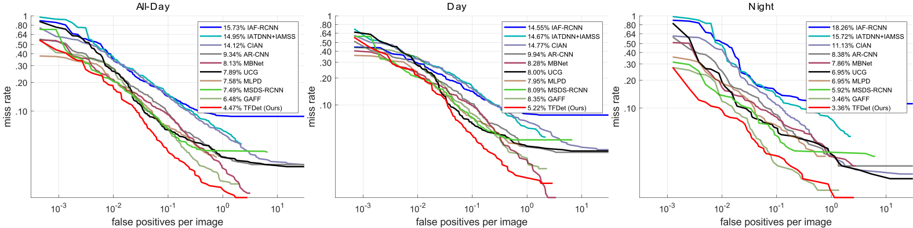

# TFDet: Target-aware Fusion for RGB-T Pedestrian Detection

**This is the official repository for our paper "TFDet: Target-aware Fusion for RGB-T Pedestrian Detection" (<u>[arxiv paper link](https://arxiv.org/abs/2305.16580)</u>).**

**Our main contributions are summarized as follows:**

- We comprehensively analyze the adverse impact of false positives on detection performance and identify the noisy feature map as a key factor contributing to these false positives.
- To address the noisy feature map issue, we propose the target-aware fusion strategy, which can effectively fuse complementary features from both modalities and highlight the feature representation in pedestrian areas while suppressing the representations in the background areas.
- Experiments show that our TFDet generates discriminative feature maps, significantly reducing false positives. Our TFDet achieves state-of-the-art performance on two challenging multi-spectral pedestrian detection benchmarks: KAIST and LLVIP. Additionally, it is computationally effective and has a comparable inference time to previous state-of-the-art approaches.
- Notably, TFDet performs especially well under challenging night scenes.

<h2 id="1">Dataset and Models</h2>

- Datasets and model checkpoints can be downloaded from this <u>[cloud link](https://pan.baidu.com/s/1ut90qAY9RAo34EHo52hRUw)</u>, extractor code: `tfde`.
- Since the KAIST dataset has been updated by several previous works, such as <u>[Hwang et al.](https://openaccess.thecvf.com/content_cvpr_2015/papers/Hwang_Multispectral_Pedestrian_Detection_2015_CVPR_paper.pdf)</u>, <u>[Li et al.](https://github.com/Li-Chengyang/MSDS-RCNN)</u>, <u>[Liu et al.](https://arxiv.org/pdf/1611.02644.pdf)</u>, and <u>[Zhang et al.](https://openaccess.thecvf.com/content_ICCV_2019/papers/Zhang_Weakly_Aligned_Cross-Modal_Learning_for_Multispectral_Pedestrian_Detection_ICCV_2019_paper.pdf)</u>, we upload this dataset for your convenience in using our code.
- The LLVIP dataset can be downloaded from its official repository.

**In the <u>[cloud link](https://pan.baidu.com/s/1ut90qAY9RAo34EHo52hRUw)</u>, files are organized as follow:**

	TFDet:
	├─datasets
	│  ├─kaist
	│  │  └─zx-sanitized-kaist-keepPerson-fillNonPerson
	│  │      ├─annotations.zip
	│  │      ├─coco_format.zip
	│  │      ├─images
	│  │      │  ├─test.zip
	│  │      │  ├─train_lwir.zip
	│  │      │  └─train_visible.zip
	│  │      ├─test.avi
	│  │      └─train.avi
	│  └─LLVIP
	│      ├─LLVIP
	│      │  ├─coco_format
	│      │  ├─lwir
	│      │  └─visible
	│      └─yolov5_format
	│          ├─images
	│          │  ├─lwir
	│          │  │  ├─test
	│          │  │  └─train
	│          │  └─visible
	│          │      ├─test
	│          │      └─train
	│          └─labels
	│              ├─lwir
	│              │  ├─test
	│              │  └─train
	│              └─visible
	│                  ├─test
	│                  └─train
	├─mmdetection
	│  ├─runs
	│  │  └─FasterRCNN_vgg16_channelRelation_dscSEFusion_similarityMax_1
	│  │      ├─epoch_
	│  │      │  ├─epoch_3-test-all.txt
	│  │      │  ├─epoch_3-test-day.txt
	│  │      │  └─epoch_3-test-night.txt
	│  │      ├─epoch_3.pkl
	│  │      └─epoch_3.pth
	│  └─runs_llvip
	│      └─FasterRCNN_r50wMask_ROIFocalLoss5_CIOU20_cosineSE_dcnGWConvGlobalCC_1024x1280
	│          ├─20230825_171907.log
	│          ├─20230825_171907.log.json
	│          └─epoch_7.pth
	└─yolov5-master
	    └─runs
	        └─train
	            └─modifiedDCN_MaskSup_negCorr_1024
	                └─weights
	                    └─best.pt

## KAIST
### Environmental Requirements
- We use Faster R-CNN implemented by the [MMDetection](https://github.com/open-mmlab/mmdetection) toolbox to detect pedestrians on the KAIST dataset. Please follow the [MMDetection](https://github.com/open-mmlab/mmdetection) documents to install environments.

In our environment, we use:
	
	python==3.7.13
	torch==1.10.1+cu111
	torchvision==0.11.2+cu111
	mmcv==1.6.0
	mmdet==2.24.1
	 

### Dataset
- Please download the KAIST dataset and checkpoint from the above cloud link, and save them following the structure shown in the **[Dataset and Models](#1)** section.
- If you solely intend to assess the inference results, feel free to download the following files: ``images/test.zip``, ``annotations.zip`` and ``coco_format.zip``.

### Inference
**Note**: the ``data_root`` and ``img_prefix`` in configuration files should be correctly modified according to your local dataset path. Please refer to the [mmdetection document](https://mmdetection.readthedocs.io/en/latest/) for more details.

Since the KAIST dataset is evaluated by the `log-average miss rate` metric, we should run three files: ``mmdetection/tools/test.py``, ``mmdetection/myCodesZoo/cvtpkl2txt_person.py``, and ``KAISTdevkit-matlab-wrapper/demo_test.m``.

We should first run the ``tools/test.py`` to generate the detection results.
	
	cd mmdetection

	# generate detection result in pkl format
	python tools/test.py configs/faster_rcnn/faster_rcnn_vgg16_fpn_sanitized-kaist_v5.py runs/FasterRCNN_vgg16_channelRelation_dscSEFusion_similarityMax_1/epoch_3.pth --work-dir runs/FasterRCNN_vgg16_channelRelation_dscSEFusion_similarityMax_1 --gpu-id 7 --eval bbox --out runs/FasterRCNN_vgg16_channelRelation_dscSEFusion_similarityMax_1/epoch_3.pkl

A few minutes later, you will obtain one pkl file named ``runs/FasterRCNN_vgg16_channelRelation_dscSEFusion_similarityMax_1/epoch_3.pkl``. Then, run the ``myCodesZoo/cvtpkl2txt_person.py`` to parse the pkl file

	cd myCodesZoo
	
	# convert detections to txt format
	python cvtpkl2txt_person.py

Then, you will obtain a folder ``runs/FasterRCNN_vgg16_channelRelation_dscSEFusion_similarityMax_1/epoch_``, which includes ``epoch_3-test-all.txt``, ``epoch_3-test-day.txt``, ``epoch_3-test-night.txt``. Meanwhile, we use the python code provided by [MLPD](https://github.com/sejong-rcv/MLPD-Multi-Label-Pedestrian-Detection/tree/main/evaluation_script) to compute the ``log-average miss rate``, and get a state-of-the-art performance: ``MR_all: 4.37, MR_day: 5.08, and MR_night: 3.36``， which is significantly better than previous state-of-the-art approaches. Nevertheless, we use the commomly-used matlab code to evaluate the ``log-average miss rate`` for fair comparisons with other approaches.

	cd ../../KAISTdevkit-matlab-wrapper

	run demo_test.m
 
Finally, you will get the result:

|Methods|MR-All($\downarrow$)|MR-Day($\downarrow$)|MR-Night($\downarrow$)|MR-Near($\downarrow$)|MR-Medium($\downarrow$)|
|:---|:---|:---|:---|:---|:---|
|MSR (AAAI 2022)|11.39|15.28|6.48|-|-|
|AR-CNN (ICCV 2019)|9.34|9.94|8.38|0.00|16.08|
|MBNet (ECCV2020)|8.13|8.28|7.86|0.00|16.07|
|DCMNet (ACM MM 2022)|5.84|6.48|4.60|0.02|16.07|
|ProbEn3 (ECCV 2022)|5.14|6.04|3.59|0.00|9.59|
|TFDet (Ours)|**4.47**|**5.22**|**3.36**|**0.00**|**9.29**|

## LLVIP
### Environmental Requirements
We use the official repositories of [MMDetection](https://github.com/open-mmlab/mmdetection) and [YOLOv5 official repository](https://github.com/ultralytics/yolov5) in our experiments. Please configure your environment following the official documentation. For MMDetection, we employ the same environment as in the experiments on the KAIST dataset. For YOLOv5, some dependencies in our environment include:
	
	python==3.7.16
	torch==1.12.1
	torchvision==0.13.1

### Dataset
- Please download the LLVIP dataset from this [link](https://github.com/bupt-ai-cz/LLVIP/blob/main/previous%20annotations.md).

- For MMDetection, you should convert the annotation into coco-format following this [document](https://mmdetection.readthedocs.io/en/latest/user_guides/train.html#train-with-customized-datasets).
- For YOLOv5, you should convert the annotation into yolo-format follow this [document](https://docs.ultralytics.com/yolov5/tutorials/train_custom_data/).

### Inference
For MMDetection, we evaluate TFDet at two resolutions. Since the LLVIP dataset have a large number of multispectral images, we use distributed inference code. 

	# 640 x 512 resolution
	CUDA_VISIBLE_DEVICES=0,1,2,3,4,5,6,7,8 PORT=29500 bash tools/zx_dist_test_llvip_640x512.sh 8 --eval bbox
	# 1280 x 1024 resolution
	CUDA_VISIBLE_DEVICES=0,1,2,3,4,5,6,7,8 PORT=29500 bash tools/zx_dist_test_llvip_1024x1280.sh 8 --eval bbox
Then, you will get:

|Methods|Resolution|AP.50($\uparrow$)|AP($\uparrow$)|
|:----|:---------|:---|:--|
|DetFusion (ACM MM 2022)|640 x 512|80.7|-|
ProbEn (ECCV2022)|640 x 512|93.4|51.5|
|TFDet (Ours)|640 x 512|**95.7**|**56.1**|
|DCMNet (ACM MM 2022)|1280 x 1024|-|58.4|
|TFDet (Ours)|1280 x 1024|96.0|**59.4**|

For YOLOv5, 

	python val.py --device 0 --data LLVIP.yaml --weights runs/train/modifiedDCN_MaskSup_negCorr_1024/weights/best.pt --batch-size 32 --img 1024 --conf-thres 0.008 --iou-thres 0.4 --exist-ok
	
Finally, you will get:
	
|Methods|AP.50($\uparrow$)|AP.75($\uparrow$)|AP($\uparrow$)|
|:---|:----|:----|:--|
|RGB (ICCV 2021)|90.8|56.4|52.7|
|Thermal (ICCV 2021)|96.5|76.4|67.0|
|TFDet (Ours)|**97.9**|**83.4**|**71.1**|

## Citation
If you find our TFDet useful, please cite our paper:

	@article{tfdet,
	title={TFDet: Target-aware Fusion for RGB-T Pedestrian Detection},
	author={Zhang, Xue and Zhang, Xiaohan and Sheng, Zehua and Shen, Hui-Liang},
	journal={arXiv preprint arXiv:2305.16580},
	year={2023}}
